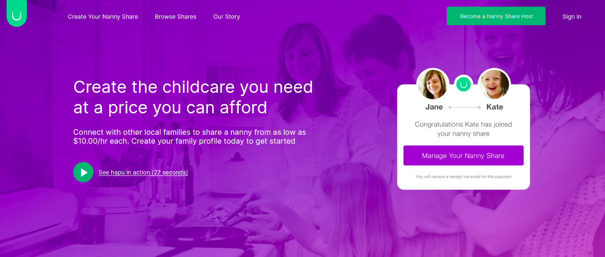

# Test Jungle Devs - Hapu homepage <a name="list"/>

-   [About this project](#about)
-   [How to install the project](#installation)
-   [How to run the project](#exec)
-   [How to create a production version](#build)
-   [A/B testing](#a/b)
-   [Improvements](#improvements)

## About the project <a name="about"/>

This project is a semi-functional version of Hapu's homepage, created with [React](https://github.com/facebook/create-react-app), [Redux](https://redux-toolkit.js.org/introduction/getting-started) and tested with [Jest](https://jestjs.io/pt-BR/docs/tutorial-react). For styling the components the pre-processor [SASS](https://sass-lang.com/) with [CSS Modules](https://github.com/css-modules/css-modules) was used and for displaying notifications the [react-toastify](https://www.npmjs.com/package/react-toastify) library was used.

<!-- toc -->

## How to install the project <a name="instalation"/> [^](#instalation)

To install the project you must have previously installed [Node.js](https://nodejs.org/en/) and its package manager [NPM](https://nodejs.org/en/) and [clone this repository](https://www.atlassian.com/br/git/tutorials/setting-up-a-repository/git-clone). To ensure the best development experience it is recommended to install Eslint and Prettier plugins in your editor.

After you have done these procedures run the following command in the folder that was created by cloning the `/test-jungle-devs` repository to install the project dependencies.

### `npm install`

## How to run the project <a name="exec"/> [^](#exec)

To start the project in development mode on port 3000 ([http://localhost:3000](http://localhost:3000)), go to the project folder `/test-jungle-devs` and run:

### `npm start`

press `Ctrl + c` to quit the project.

To start the integration tests, inside the project folder `/test-jungle-devs` run:

### `npm test`

press `q` to quit the test runner.

## How to create a production version <a name="build"/> [^](#build)

To create a production version for go to the `/test-jungle-devs` project folder and run:

### `npm build`

This command will create a new `/build` folder, this folder contains all the code minified and transpiled to older versions of javascript to ensure it works in older browsers. Use this folder as content in your deploys.

## A/B Test <a name="a/b"/> [^](#a/b)

This project performs an experiment where 50% of the audience receives a different message in the Hero component,
the results of the test can be seen [here](https://app.optimizely.com/l/nRjsaTIcRgeWj4ePDxzNLg)

    
 variant 1:

    

    
 variant 2:

    

## Enhancements <a name="enhancements"/> [^](#list)

-   Implementation of integration tests on user-critical functions
    -   Correct screen rendering
    -   Form working as expected
-   Added toastify library to improve API feedback.
